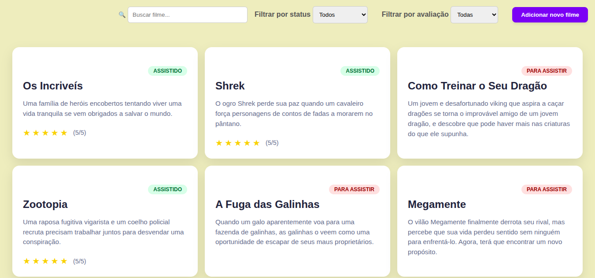
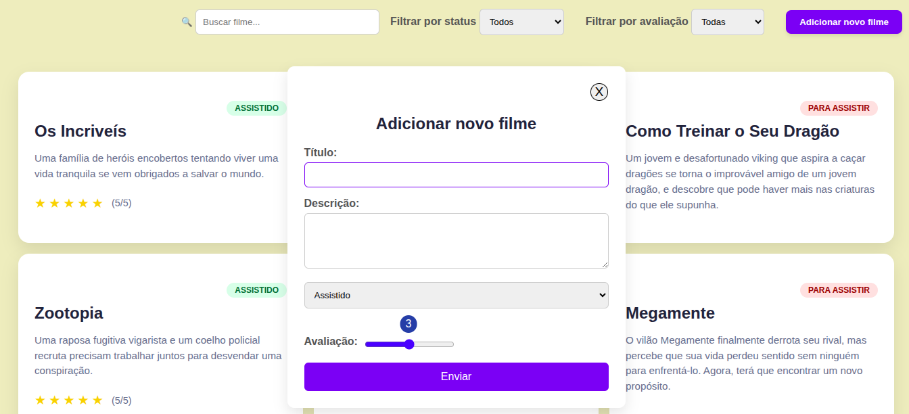
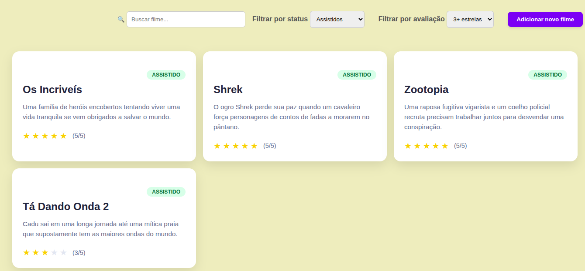
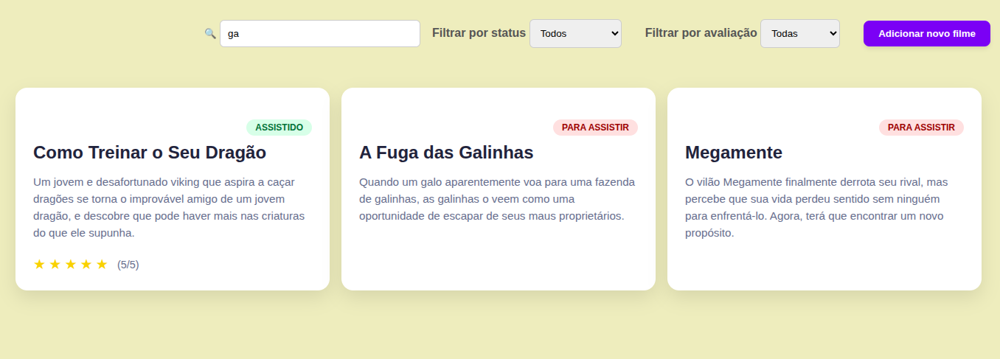

# 🎬 Controle de Filmes Assistidos

Sistema web desenvolvido com Laravel para gerenciamento pessoal de filmes assistidos e filmes que o usuário deseja assistir.

O projeto permite cadastrar, editar, visualizar e remover filmes, além de oferecer funcionalidades de busca e filtragem para facilitar a organização da coleção.

## 📸 Screenshots

### Listagem




### Cadastro




### Filtros




### Busca por Título



## ✨ Funcionalidades

* CRUD de filmes
* Busca por título
* Filtro por status:

  * Assistido
  * Quero assistir
* Filtro por avaliação:

  * 2 estrelas ou mais
  * 3 estrelas ou mais
  * 4 estrelas ou mais
  * 5 estrelas


## 🛠️ Tecnologias Utilizadas

* PHP 8+
* Laravel
* Blade
* MySQL
* HTML5
* CSS3
* JavaScript


## 📂 Estrutura do Projeto

```text
app/
├── Http/
│   └── Controllers/
├── Models/
resources/
├── views/
│   ├── components/
│   └── movies/
database/
├── migrations/
routes/
└── web.php
```


## 📚 Aprendizados

Durante o desenvolvimento deste projeto foram praticados conceitos como:

* Arquitetura MVC
* Eloquent ORM
* Query Builder
* Rotas e Controllers
* Componentes Blade
* Formulários com método GET e POST
* Filtros dinâmicos
* Busca utilizando `LIKE`
* Validação de dados
* Integração com banco de dados MySQL


## 🚀 Como Executar o Projeto

### 1. Clonar o repositório

```bash
git clone https://github.com/LarissaBSantos/controle-de-filmes-assistidos
```

### 2. Acessar a pasta

```bash
cd controle-de-filmes-assistidos
```

### 3. Instalar dependências

```bash
composer install
```

### 4. Configurar o arquivo `.env`

Configure as credenciais do banco de dados:

```env
DB_CONNECTION=mysql
DB_HOST=127.0.0.1
DB_PORT=3306
DB_DATABASE=controle_de_filmes_assistidos
DB_USERNAME=root
DB_PASSWORD=
```

### 5. Gerar a chave da aplicação

```bash
php artisan key:generate
```

### 6. Executar as migrations

```bash
php artisan migrate
```

### 7. Iniciar o servidor

```bash
php artisan serve
```

A aplicação estará disponível em:

```text
http://127.0.0.1:8000
```
